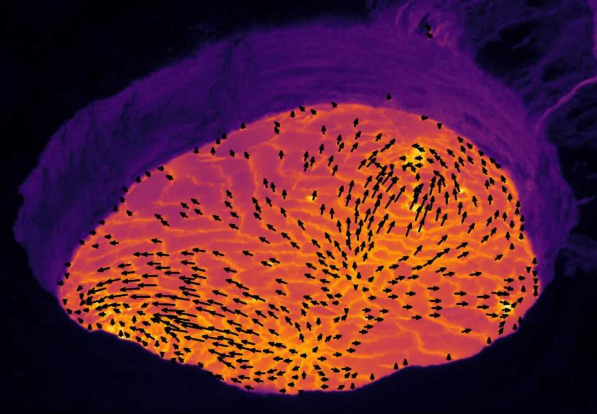

## Course information
This class is a general introduction to computer vision methods relevant in geosciences. It covers basic digital image processing, classic computer vision and machine learning algorithms, as well as modern deep learning approaches.

It was first conceptualized and taught by Sébastien Valade ([UNAM](https://svalade.github.io/)) and Manuel Wöllhaf ([TUB](https://www.tu.berlin/cv/ueber-uns/manuel-woellhaf)) at UNAM in 2021. An updated version of the course was taught at UNAM in 2024, with guest speaker Ronny Hänsch ([DLR](http://www.rhaensch.de/)).

    

## Instructors
* instructor: Sébastien Valade ([UNAM](https://svalade.github.io/))
* co-instructor (2021): Manuel Wöllhaf ([TUB](https://www.tu.berlin/cv/ueber-uns/manuel-woellhaf))
* co-instructor (2024): Ronny Hänsch ([DLR](http://www.rhaensch.de/))

## Course editions

* [2024 edition](./2024/index.md)
* [2021 edition](./2021/index.md)