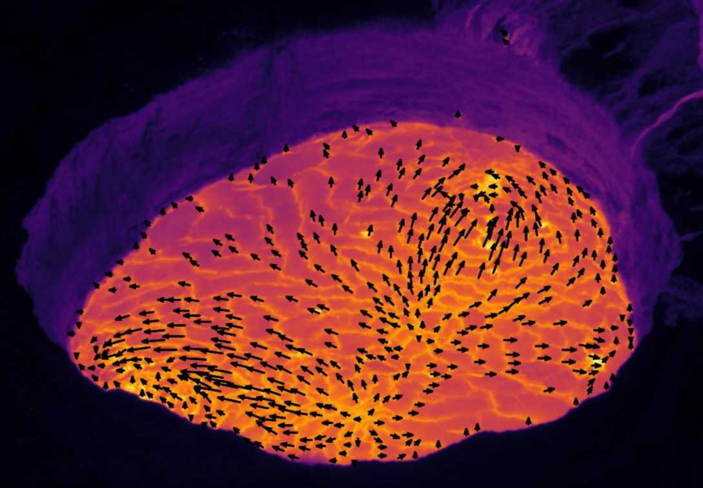

## Course information
This class is a general introduction to computer vision methods relevant in geosciences. It covers basic digital image processing, classic computer vision and machine learning algorithms, as well as modern deep learning approaches.

It was first conceptualized and taught by Sébastien Valade ([UNAM](https://svalade.github.io/)) and Manuel Wöllhaf ([TUB](https://www.tu.berlin/cv/ueber-uns/manuel-woellhaf)) at UNAM in 2021. A second, updated edition was taught in 2024, with guest speaker Ronny Hänsch ([DLR](http://www.rhaensch.de/)). A third edition was taught in 2026, with collaboration from Sophie Giffard-Roisin ([IRD - ISTerre](https://sophiegif.github.io/)) for the group projects in deep learning.

    

## Instructors
* instructor: Sébastien Valade ([UNAM](https://svalade.github.io/))
* co-instructor (2021): Manuel Wöllhaf ([TUB](https://www.tu.berlin/cv/ueber-uns/manuel-woellhaf))
* co-instructor (2024): Ronny Hänsch ([DLR](http://www.rhaensch.de/))
* co-instructor (2026): Sophie Giffard-Roisin ([IRD - ISTerre](https://sophiegif.github.io/))

## Course editions

* [2026 edition](./2026/index.md)
* [2024 edition](./2024/index.md)
* [2021 edition](./2021/index.md)